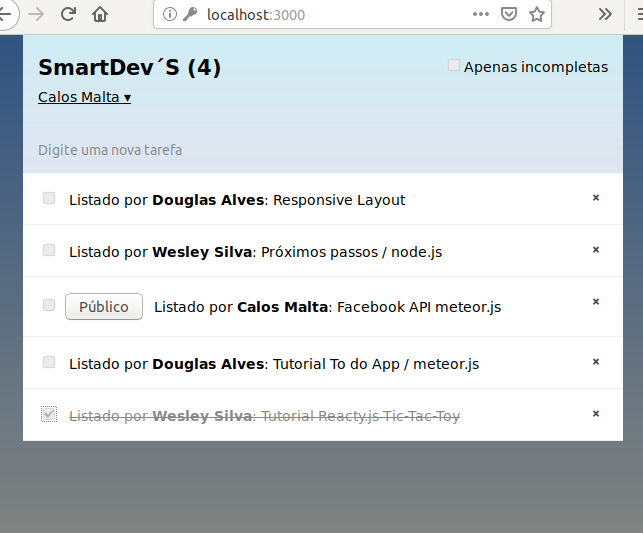

## SmartDevs - lista de tarefas compartilhada
**Projeto: aplicativo desenvolvido com framework meteor.js (node.js, react.js e mogoDB).**


Uma simples lista de tarefas que suporta colaboração, cadastro de usuarios, login com o facebook e atualiza informações em tempo real com os clientes e o servidor.



Baseado no [ tutorial oficial](https://www.meteor.com/tutorials/react/creating-an-app) do meteor.js.

O app roda em um [ Docker container](https://www.docker.com/get-started).
### Requisitos
* Docker v19.03.6
* Meteor v1.8.0.2

Se você está trabalhando com windows e não tem suporte para virtualização com Hyper-V use o [Docker Toolbox](https://docs.docker.com/toolbox/toolbox_install_windows/)
### Configuração

Depois de clonar o repos, entre na pasta raiz e instale as dependências:
```console
$ meteor npm install --save @babel/runtime react react-dom classnames
```
Execute o projeto com o comando meteor:
```console
$ meteor 
```
Navegue até https://localhost:3000 você deve ver o app funcionando.

Agora execute o comando build do meteor para montar o pacote para deploy:
```console
$ meteor build . 
```
Vá até o arquivo *Dockerfile* e altere *<MONGO_URL>* pela sua string de conexão.

Crie sua imagem:
```console
$ docker image build . --tag smartdevs
```

Aguarde até o fim da criação da imagem e inicie um *container* executando:
```
$ docker run --publish 3000:3000 --name smartdevs-container smartdevs
```
Navegue até https://localhost:3000 você deve ver o app funcionando.

### Docker Toobox
Se você estiver utilizando o docker toolbox o app vai estar disponível no ip da VM docker-machine.

para descobrir o ip execute:
```console
$ docker-machine ip
```
Se o ip for *192.168.99.100* por exemplo, navegue até https://192.168.99.100:3000 você deve ver o app funcionando.


